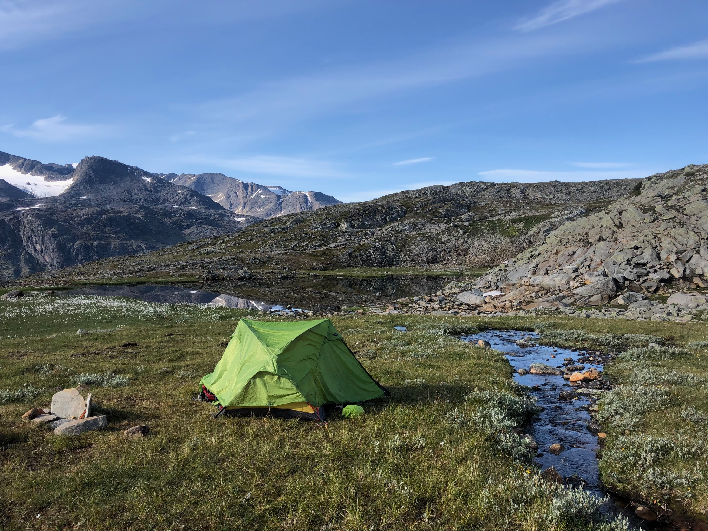
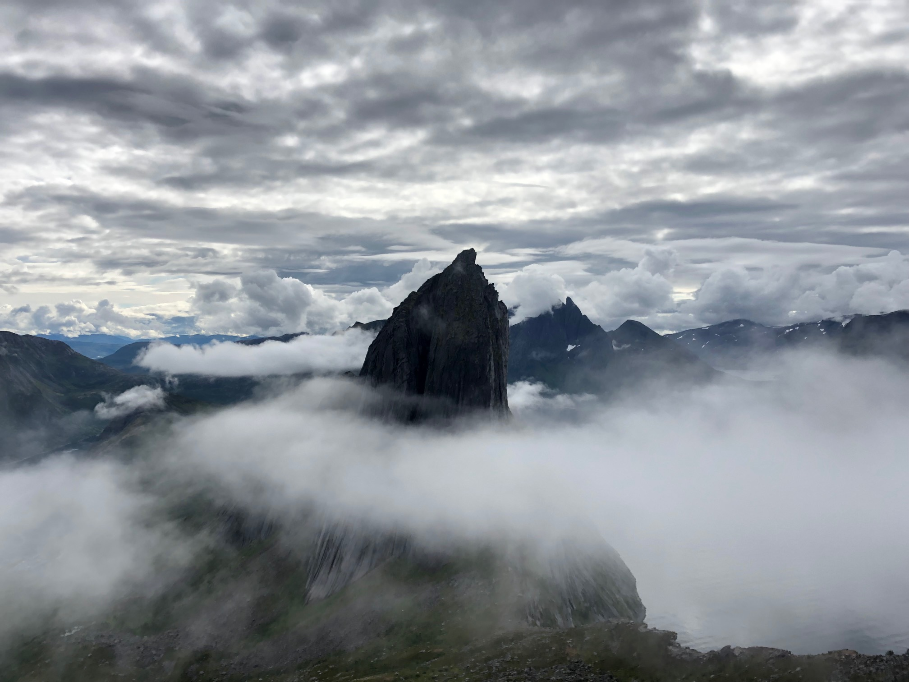
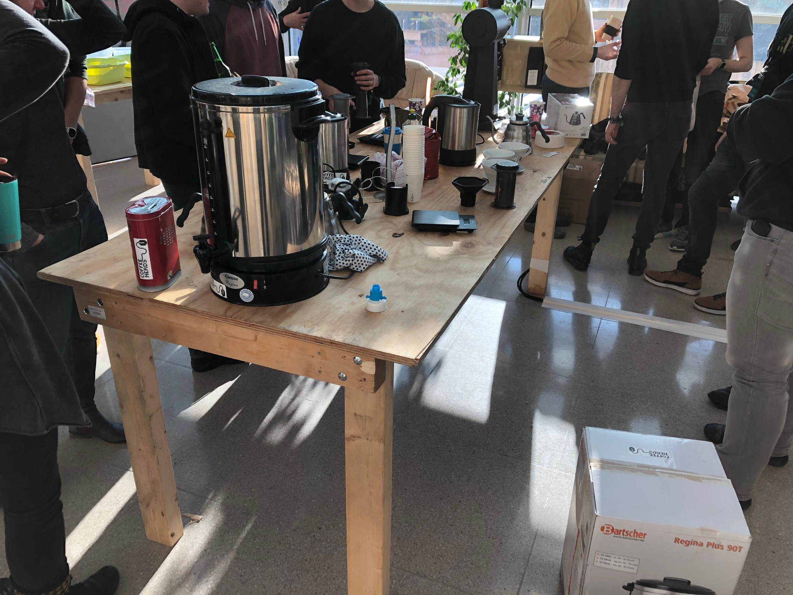
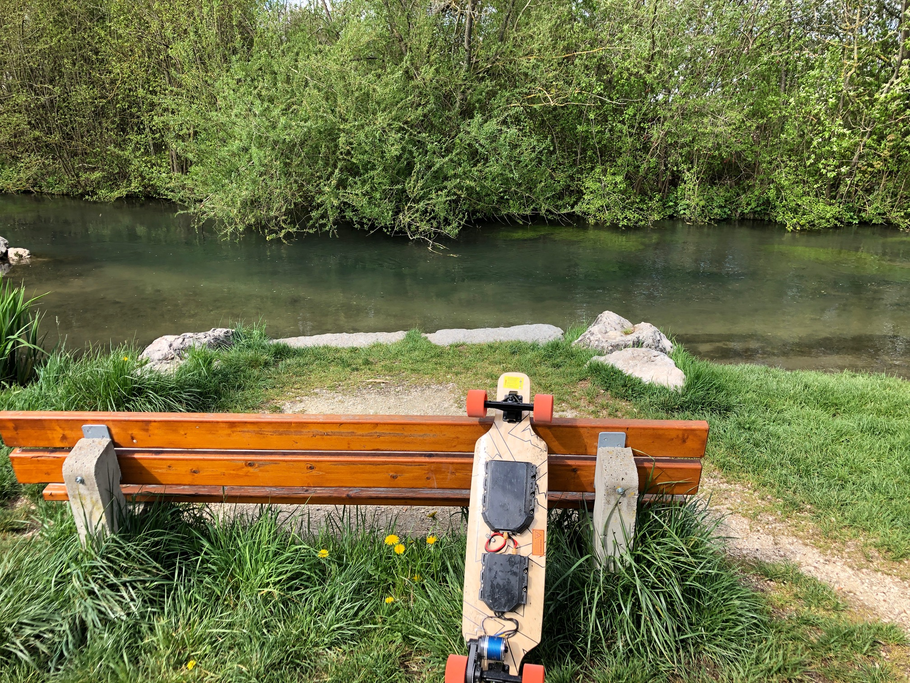

% Introduction
% David Jäckel
% 4.11.24

# Introduction

## Content

* About me
* Educational background
* Occupational background
* Private background

## About me

* Name: David Jäckel
* Age: 36
* Location: Ulm
* Degree: M.Sc. Medieninformatik
* Occupation: Software Engineer since 2015

# Education

## Education

## Education

## Education

## Education

## Internship

## Internship

## Student work

## Student work

## Thesis

## Thesis

# Occupation

## e.solutions

## e.solutions

## Elektrobit

## Elektrobit

## Continental

## Continental

# Private

## Hobbies

* Music
* Rock climbing
* Hiking
* Paragliding
* Chaos Communication Congress
* Makerspace

## Music

## Rock climbing

## Rock climbing

## Hiking

## Hiking

## Hiking

## Paragliding

## Paragliding

## Chaos Communication Congress

## Chaos Communication Congress

## Makerspace

## Makerspace

## Makerspace

# Links

## Links

